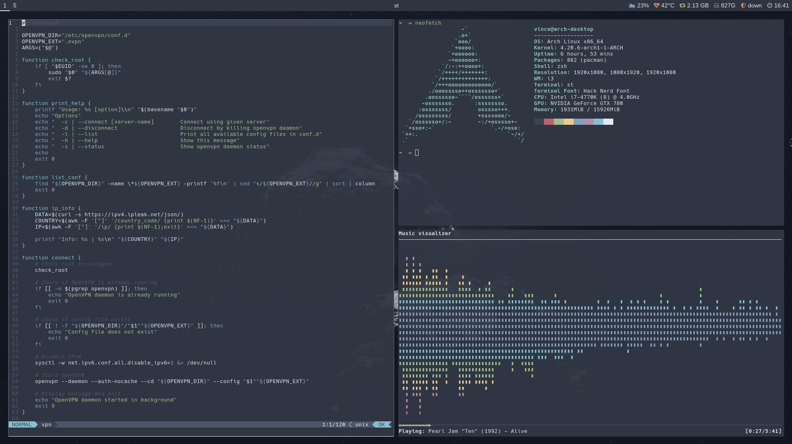

# Dotfiles


[](https://github.com/Vincevrp/dotfiles/releases)
[](https://github.com/Vincevrp/dotfiles)

[](https://github.com/Vincevrp/dotfiles/blob/master/LICENSE)

## Introduction

This repository contains the configuration files (dotfiles) for my desktop workstation, based on Antergos/Arch Linux. Other branches are used for my other devices.

### Initialize

I use a bare git repository to manage my dotfiles. To initialize use the following commands:

```
git clone --bare <git-repo-url> $HOME/.dotfiles
alias dotfiles='git --git-dir=$HOME/.dotfiles --work-tree=$HOME'
dotfiles checkout
dotfiles config --local status.showUntrackedFiles no
```

If you receive an error message about untracked working tree files; run the following command:

```
mkdir -p dot-backup && \
dotfiles checkout 2>&1 | egrep "\s+\." | awk {'print $1'} | \
xargs -I{} mv {} .dot-backup/{}
```

The idea behind the method described here is based on [this](https://developer.atlassian.com/blog/2016/02/best-way-to-store-dotfiles-git-bare-repo/) article.

### Screenshots




## Contents

Listed below are the main components of my setup. This does not include everything, only the main configuration that is necessary for the core looks and functionality, and other components that needs extra information.

### Bash

Used as a backup shell, I mainly use [zsh](#zsh).

### Color scheme

All colors are based on [Nord](https://github.com/arcticicestudio/nord).

[//]: # (Inline HTML to center the image)

<div align="center">
    
</div>
<br>

Some files come from the official repository, which may or may not be modified:
- `.Xresources`
- `.dir_colors`

I may have referenced the same colors in other configuration files that are not officially supported by Nord.

### Fonts

The following fonts are used throughout this config:

- [Font Awesome](https://github.com/FortAwesome/Font-Awesome)
- [San Francisco](https://github.com/supermarin/YosemiteSanFranciscoFont)
- [Powerline Fonts](https://github.com/powerline/fonts)

### i3-gaps

I use [i3-gaps](https://www.archlinux.org/packages/community/x86_64/i3-gaps/) as my window manager. It's a highly customizable tiling WM, refer to `.config/i3/config` for my usage and keybindings.

#### Compton

[Compton](https://github.com/chjj/compton) is used for display compositing.

#### Polybar

[Polybar](https://github.com/jaagr/polybar) is the statusbar that I use for i3. Configuration files and scripts are stored in `.config/polybar`.

##### openvpn

I wrote a python script for polybar that works together with my vpn script found in `.bin/vpn`. The vpn script writes a PID file and the openvpn scripts parses this to display the configuration file name.

#### Rofi

[Rofi](https://github.com/DaveDavenport/rofi) is used as my application launcher.

#### Rxvt-unicode

[urxvt](https://wiki.archlinux.org/index.php/Rxvt-unicode) is set as the default terminal for i3. It uses `.Xresources` for its configuration.

### Ranger

Run `ranger --copy-config=all` before copying `rc.conf` to get the required default configuration.

### Tmux

Requires [tpm](https://github.com/tmux-plugins/tpm) to be installed. Refer to the repository for usage and installation instructions.

### Vim

Requires [vim-plug](https://github.com/junegunn/vim-plug) to be installed from AUR.

Extra syntax checkers:

- [JSHint](https://github.com/jshint/jshint/): Install by running `sudo npm install -g jshint`.
- [Sass-lint](https://github.com/sasstools/sass-lint): Install by running `sudo npm install -g sass-lint`.

### X.org

[X.org](https://www.x.org/) requires different files:

- `.xinitrc`
  - Makes sure that i3 starts when the Xserver starts.
- `.Xmodmap`
  - I rebind caps lock to the mod key for [i3](#i3wm).
- `.Xresources`
  - [Nord](#color-scheme) color scheme.
  - [Rofi](#rofi) theme using the colors from Nord.
  - [Rxvt-unicode](#rxvt-unicode) settings.

### Zsh

I use zsh as my main shell. Everything in `~/.bin/` is available in `$PATH`.

#### Antigen

Requires [Antigen](https://github.com/zsh-users/antigen) to be installed. Refer to the repository for usage and installation instructions.

#### fzf

fzf is used by both vim and zsh. Install by running `sudo pacman -S fzf`.

## License

See [LICENSE](../LICENSE)
